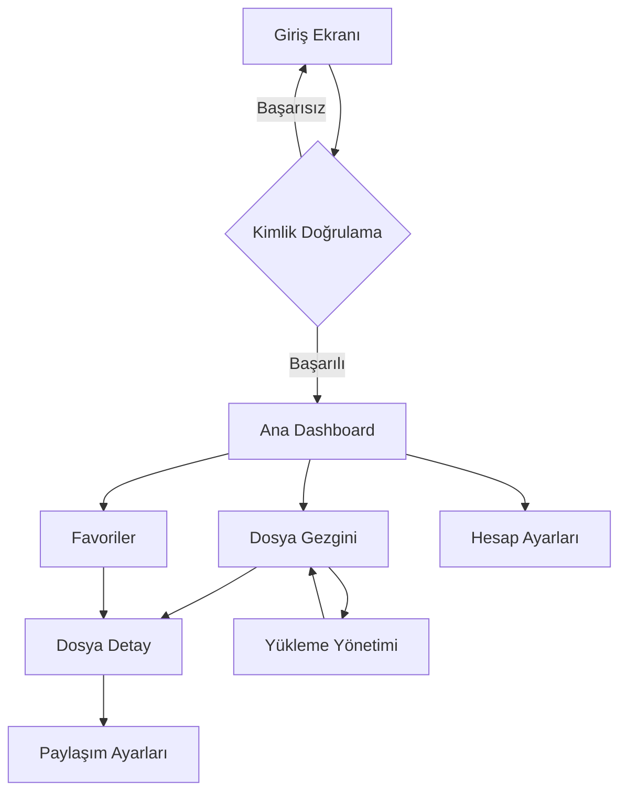
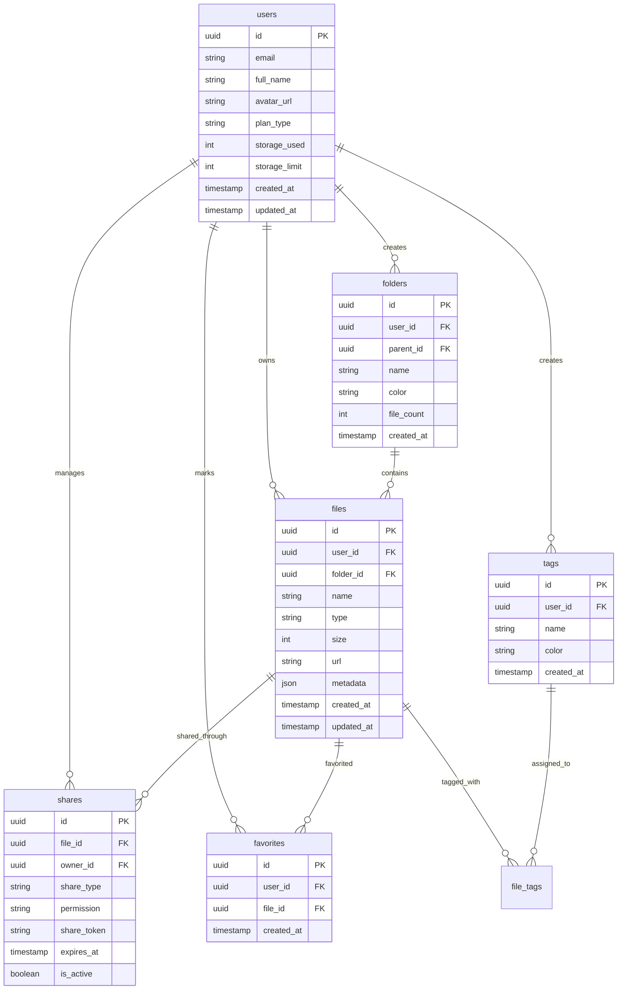

# React Native Expo File Manager - Teknik Özellikler Belgesi

## 1. Ürün Genel Bakış

Modern, kullanıcı dostu bir mobil dosya yönetim uygulaması. Kullanıcıların dosyalarını organize etmelerini, paylaşmalarını ve yönetmelerini sağlar. Expo Router ile çoklu ekran navigasyonu ve React Native ile native performans sunar.

**Hedef Kitle:** Mobil cihaz kullanıcıları için modern dosya yönetimi çözümü
**Problem:** Kullanıcıların dosyalarını etkili bir şekilde organize etme ve paylaşma ihtiyacı
**Çözüm:** Sezgisel UI/UX ile güçlü dosya yönetimi özellikleri

## 2. Çekirdek Özellikler

### 2.1 Kullanıcı Rolleri

| Rol | Kayıt Yöntemi | Temel İzinler |
|-----|---------------|---------------|
| Normal Kullanıcı | Email, Google, Apple ile kayıt | Dosya yükleme, organize etme, paylaşma |
| Premium Kullanıcı | Ücretli abonelik | Artırılmış depolama alanı, gelişmiş paylaşım özellikleri |

### 2.2 Özellik Modülleri

Uygulama aşağıdaki temel ekranlardan oluşur:

1. **Giriş Ekranı:** Kullanıcı girişi, sosyal medya ile giriş, şifre yenileme
2. **Ana Dashboard:** Dosya istatistikleri, son aktiviteler, hızlı erişim klasörleri
3. **Dosya Gezgini:** Klasör navigasyonu, liste görünümü, dosya arama ve filtreleme
4. **Dosya Detay & Önizleme:** Dosya bilgileri, önizleme, paylaşım ayarları
5. **Yükleme Yönetimi:** Dosya yükleme ilerlemesi, iptal etme, sıralama
6. **Favoriler & Etiketleme:** Favori dosyalar, etiket filtreleme, arama
7. **Hesap Ayarları:** Profil yönetimi, depolama bilgileri, tercihler
8. **Paylaşım Ayarları:** Dosya paylaşımı, bağlantı oluşturma, izin yönetimi

### 2.3 Sayfa Detayları

| Sayfa Adı | Modül Adı | Özellik Açıklaması |
|-----------|-------------|---------------------|
| Giriş Ekranı | Giriş Formu | Email ve şifre ile giriş, sosyal medya giriş butonları (Google, Apple), şifremi unuttum bağlantısı |
| Giriş Ekranı | Form Doğrulama | Email format kontrolü, şifre uzunluğu kontrolü, hata mesajları |
| Ana Dashboard | İstatistik Kartları | Toplam dosya sayısı, kullanılan depolama alanı, paylaşılan bağlantılar |
| Ana Dashboard | Sık Kullanılanlar | 4 adet sık kullanılan klasör kartı, renk kodlu ikonlar, dosya sayısı |
| Ana Dashboard | Son Aktiviteler | Son 4 dosya işlemi, dosya tipi ikonları, zaman damgaları |
| Dosya Gezgini | Navigasyon Çubuğu | Geri butonu, klasör adı, arama ve filtre ikonları |
| Dosya Gezgini | Breadcrumb | Klasör hiyerarşisi görünümü, hızlı navigasyon |
| Dosya Gezgini | Dosya Listesi | Liste görünümü, dosya ikonları, boyut ve tarih bilgileri |
| Dosya Detay | Önizleme Alanı | PDF, resim ve doküman önizlemesi, tam ekran modu |
| Dosya Detay | Dosya Bilgileri | Dosya adı, versiyon, konum, etiketler |
| Dosya Detay | Meta Veri | Boyut, tip, oluşturulma tarihi, düzenlenme tarihi |
| Dosya Detay | İşbirlikçiler | Erişim verilen kullanıcılar, avatar gösterimi |
| Yükleme Yönetimi | Yükleme Alanı | Drag & drop desteği, dosya seçme dialogu |
| Yükleme Yönetimi | İlerleme Takibi | Aktif yükleme ilerlemesi, hız ve kalan süre |
| Favoriler | Arama Çubuğu | Favoriler içinde arama, filtreleme |
| Favoriler | Etiket Filtreleri | Renkli etiket butonları, yeni etiket ekleme |
| Favoriler | Klasör Gridi | 2 sütunlu klasör kartları, favori yıldız ikonu |
| Favoriler | Dosya Gridi | 2 sütunlu dosya kartları, küçük önizlemeler |
| Hesap Ayarları | Profil Fotoğrafı | Kamera ile fotoğraf çekme, galeriden seçme |
| Hesap Ayarları | Kullanıcı Bilgileri | Ad, email düzenleme, form doğrulama |
| Hesap Ayarları | Depolama Bilgisi | Kullanılan/total alan, yüzde gösterimi, yükseltme butonu |
| Hesap Ayarları | Tercihler | Karanlık mod geçişi, bildirim ayarları, güvenlik |
| Paylaşım Ayarları | Davet Formu | Email girme, izin seviyesi seçimi (görüntüleme, düzenleme) |
| Paylaşım Ayarları | Erişim Listesi | Paylaşılan kullanıcılar, izin düzenleme, kaldırma |
| Paylaşım Ayarları | Bağlantı Ayarları | Genel erişim, bağlantı son kullanma tarihi, kopyalama |

## 3. Çekirdek İşlem Akışları

### Kullanıcı Giriş Akışı:
1. Uygulama açılır → Giriş ekranı gösterilir
2. Kullanıcı email/şifre girer veya sosyal medya ile giriş yapar
3. Kimlik doğrulama başarılı → Ana dashboard'a yönlendirilir
4. Başarısız → Hata mesajı gösterilir

### Dosya Yükleme Akışı:
1. Dashboard'da "+" butonuna basılır
2. Yükleme modal'ı açılır
3. Dosya seçilir veya drag & drop ile bırakılır
4. Yükleme ilerlemesi gösterilir
5. Tamamlandıktan sonra dosya listesine eklenir

### Dosya Paylaşma Akışı:
1. Dosya üzerinde "paylaş" butonuna basılır
2. Paylaşım modal'ı açılır
3. Kullanıcı email'i girilir ve izin seviyesi seçilir
4. Davet gönderilir
5. Bağlantı kopyalanabilir



## 4. Kullanıcı Arayüzü Tasarımı

### 4.1 Tasarım Stili

**Renk Paleti:**
- Birincil Renk: #3e577a (Mavi-gri)
- İkincil Renkler: #2c3e56 (Koyu mavi), #f9fafb (Açık gri arka plan)
- Vurgu Renkleri: Yeşil (başarı), Kırmızı (hata), Sarı (uyarı)

**Tipografi:**
- Font Ailesi: Inter (Google Fonts)
- Başlıklar: 700-800 kalınlık, 18-24px
- Gövde Metni: 400-500 kalınlık, 14-16px
- Küçük Metin: 12-13px

**Buton Stilleri:**
- Yuvarlatılmış köşeler (8-12px border-radius)
- Gölge efektleri (shadow-card, shadow-soft)
- Hover durumları için renk geçişleri
- Aktif durumda scale transform (0.98)

**İkon Stilleri:**
- Material Symbols Outlined font kullanımı
- 20-32px arası boyutlar
- Dolgu (fill) ve kontur (outline) varyasyonları
- Renk kodlu kategorizasyon (sarı klasör, mavi dosya vb.)

### 4.2 Sayfa Tasarımı Genel Bakış

| Sayfa Adı | Modül Adı | UI Elementleri |
|-----------|-------------|-------------|
| Giriş Ekranı | Logo Alanı | Gradyan arka plan, 64x64px logo, animasyonlu pulse efekti |
| Giriş Ekranı | Form Alanı | 12px yuvarlatılmış inputlar, ikon prefix'ler, 48px yükseklik |
| Ana Dashboard | İstatistik Kartları | 160-180px genişlik, yumuşak gölge, renk kodlu ikonlar |
| Ana Dashboard | Arama Çubuğu | 56px yükseklik, yuvarlatılmış köşeler, ikon entegrasyonu |
| Dosya Gezgini | Liste Öğeleri | 12px yuvarlatılmış kartlar, avatar stack'leri, badge'ler |
| Dosya Detay | Önizleme | 4:5 aspect ratio, overlay gradient, fullscreen butonu |
| Dosya Detay | Bilgi Kartı | 2 sütunlu grid, ikonlu etiketler, progress bar'lar |
| Yükleme Modal | Yükleme Alanı | 2px dashed border, 16px yuvarlatılmış köşeler, ikon merkezi |
| Favoriler | Grid Düzeni | 2 sütunlu responsive grid, 8px gap, yıldız favori ikonu |
| Hesap Ayarları | Form Alanı | 56px yükseklik, ikon prefix'ler, focus ring efektleri |
| Paylaşım Modal | Kullanıcı Listesi | Avatar gösterimi, dropdown butonları, izin etiketleri |

### 4.3 Responsive Tasarım

**Mobil-First Yaklaşım:**
- Minimum 320px genişlik desteği
- Esnek grid sistemleri (Flexbox)
- Dokunma hedefleri minimum 44x44px
- Kaydırma (scroll) optimizasyonları
- Safe area desteği (iPhone notch, Android navigation)

**Tablet Uyumluluğu:**
- 768px ve üzeri için genişletilmiş düzenler
- 3-4 sütunlu grid gösterimleri
- Yan panel navigasyonu

**Performans Optimizasyonu:**
- Görsel yükleme optimizasyonları (lazy loading)
- Scroll performansı için native driver kullanımı
- Görsel sıkıştırma ve önbellekleme stratejileri

## 5. Teknoloji Stack'i

### Frontend Teknolojileri:
- **React Native 0.72+** - Cross-platform mobil geliştirme
- **Expo SDK 49+** - Geliştirme araçları ve native API erişimi
- **Expo Router v2** - Dosya tabanlı navigasyon
- **TypeScript 5+** - Tip güvenliği ve geliştirici deneyimi
- **TailwindCSS (NativeWind)** - Utility-first styling
- **React Native Reanimated 3** - Yüksek performanslı animasyonlar
- **React Native Gesture Handler** - Native gesture'lar
- **Expo Image** - Optimize edilmiş görsel yükleme
- **React Hook Form** - Form yönetimi ve doğrulama

### Backend Hizmetleri:
- **Supabase** - Backend-as-a-Service
  - PostgreSQL veritabanı
  - Authentication (Email, Google, Apple)
  - Storage (dosya yükleme/depolama)
  - Real-time subscriptions
  - Row Level Security (RLS)

### Üçüncü Parti Hizmetler:
- **Material Symbols** - Google'ın ikon kütüphanesi
- **React Native Bottom Sheet** - Modal ve bottom sheet'ler
- **Expo Document Picker** - Dosya seçme
- **Expo File System** - Yerel dosya işlemleri
- **Expo Sharing** - Dosya paylaşma

### Geliştirme Araçları:
- **ESLint + Prettier** - Kod kalitesi ve formatlama
- **Husky + lint-staged** - Git hook'ları
- **React Native Debugger** - Hata ayıklama
- **Expo Dev Client** - Gelişmiş geliştirme ortamı

## 6. Navigasyon Yapısı (Expo Router)

```
app/
├── (auth)/
│   ├── _layout.tsx          # Auth layout (stack)
│   ├── login.tsx            # Login screen
│   └── register.tsx         # Registration screen
├── (tabs)/
│   ├── _layout.tsx          # Tab layout
│   ├── index.tsx            # Dashboard (home)
│   ├── files/               # Files tab
│   │   ├── _layout.tsx      # Files stack
│   │   ├── index.tsx        # File explorer
│   │   └── [id].tsx         # File detail
│   ├── favorites.tsx        # Favorites tab
│   └── settings.tsx         # Settings tab
├── (modals)/
│   ├── upload.tsx           # Upload modal
│   ├── share.tsx            # Share settings modal
│   └── profile.tsx          # Profile modal
└── _layout.tsx              # Root layout
```

**Navigasyon Türleri:**
- **Stack Navigator:** Auth flow, dosya detayları
- **Tab Navigator:** Ana navigasyon (Dashboard, Files, Favorites, Settings)
- **Modal Navigator:** Yükleme, paylaşım, profil modal'ları
- **Dynamic Routes:** Dosya ID'leri ile dinamik ekranlar

## 7. Veri Modeli ve API Yapısı

### 7.1 Veritabanı Şeması (Supabase)



### 7.2 Supabase DDL ve Güvenlik Kuralları

```sql
-- Users table (Supabase Auth ile entegre)
CREATE TABLE users (
    id UUID PRIMARY KEY DEFAULT auth.uid(),
    email VARCHAR(255) UNIQUE NOT NULL,
    full_name VARCHAR(100) NOT NULL,
    avatar_url TEXT,
    plan_type VARCHAR(20) DEFAULT 'free' CHECK (plan_type IN ('free', 'premium', 'enterprise')),
    storage_used INTEGER DEFAULT 0,
    storage_limit INTEGER DEFAULT 10737418240, -- 10GB in bytes
    created_at TIMESTAMP WITH TIME ZONE DEFAULT NOW(),
    updated_at TIMESTAMP WITH TIME ZONE DEFAULT NOW()
);

-- Files table
CREATE TABLE files (
    id UUID PRIMARY KEY DEFAULT gen_random_uuid(),
    user_id UUID NOT NULL REFERENCES users(id) ON DELETE CASCADE,
    folder_id UUID REFERENCES folders(id) ON DELETE SET NULL,
    name VARCHAR(255) NOT NULL,
    type VARCHAR(50) NOT NULL,
    size INTEGER NOT NULL,
    url TEXT NOT NULL,
    metadata JSONB DEFAULT '{}',
    created_at TIMESTAMP WITH TIME ZONE DEFAULT NOW(),
    updated_at TIMESTAMP WITH TIME ZONE DEFAULT NOW()
);

-- Folders table
CREATE TABLE folders (
    id UUID PRIMARY KEY DEFAULT gen_random_uuid(),
    user_id UUID NOT NULL REFERENCES users(id) ON DELETE CASCADE,
    parent_id UUID REFERENCES folders(id) ON DELETE CASCADE,
    name VARCHAR(100) NOT NULL,
    color VARCHAR(7) DEFAULT '#3e577a',
    file_count INTEGER DEFAULT 0,
    created_at TIMESTAMP WITH TIME ZONE DEFAULT NOW()
);

-- Row Level Security (RLS) Policies
ALTER TABLE files ENABLE ROW LEVEL SECURITY;
ALTER TABLE folders ENABLE ROW LEVEL SECURITY;

-- Files policies
CREATE POLICY "Users can view their own files" ON files
    FOR SELECT USING (auth.uid() = user_id);

CREATE POLICY "Users can insert their own files" ON files
    FOR INSERT WITH CHECK (auth.uid() = user_id);

CREATE POLICY "Users can update their own files" ON files
    FOR UPDATE USING (auth.uid() = user_id);

CREATE POLICY "Users can delete their own files" ON files
    FOR DELETE USING (auth.uid() = user_id);

-- Grant permissions
GRANT SELECT ON files TO anon;
GRANT ALL ON files TO authenticated;
GRANT SELECT ON folders TO anon;
GRANT ALL ON folders TO authenticated;
```

## 8. Bileşen Mimarisi

### 8.1 Ortak Bileşenler

```typescript
// UI Components
components/
├── ui/
│   ├── Button.tsx              # Temel buton bileşeni
│   ├── Card.tsx                # Kart konteyneri
│   ├── Input.tsx               # Form input'ları
│   ├── Avatar.tsx              # Kullanıcı avatar'ı
│   ├── Badge.tsx               # Etiket ve badge'ler
│   ├── ProgressBar.tsx         # Yükleme ilerlemesi
│   ├── Icon.tsx                # Material Symbols wrapper
│   └── Modal.tsx               # Modal konteyneri
│
├── features/
│   ├── files/
│   │   ├── FileListItem.tsx    # Dosya listesi öğesi
│   │   ├── FileGridItem.tsx    # Dosya grid öğesi
│   │   ├── FileIcon.tsx        # Dosya tipi ikonu
│   │   └── FilePreview.tsx     # Dosya önizleme
│   │
│   ├── folders/
│   │   ├── FolderCard.tsx      # Klasör kartı
│   │   ├── FolderIcon.tsx      # Klasör ikonu
│   │   └── Breadcrumb.tsx      # Navigasyon breadcrumb
│   │
│   ├── upload/
│   │   ├── UploadArea.tsx      # Drag & drop alanı
│   │   ├── UploadProgress.tsx  # Yükleme ilerlemesi
│   │   └── UploadQueue.tsx     # Yükleme sırası
│   │
│   └── sharing/
│       ├── ShareModal.tsx      # Paylaşım modal'ı
│       ├── UserList.tsx        # Kullanıcı listesi
│       └── PermissionToggle.tsx # İzin anahtarı
│
└── layout/
    ├── Header.tsx              # Üst navigasyon
    ├── TabBar.tsx              # Alt tab navigasyon
    ├── Sidebar.tsx              # Yan menü (tablet)
    └── SafeArea.tsx            # Safe area wrapper
```

### 8.2 Hook'lar ve Servisler

```typescript
// Custom Hooks
hooks/
├── useAuth.ts                  # Kimlik doğrulama
├── useFiles.ts                 # Dosya işlemleri
├── useUpload.ts                # Yükleme yönetimi
├── useShare.ts                 # Paylaşım işlemleri
├── useStorage.ts               # Depolama hesaplamaları
├── useNetwork.ts               # Ağ durumu
└── usePermissions.ts           # İzin yönetimi

// Services
services/
├── supabase.ts                 # Supabase client
├── storage.ts                  # Dosya depolama
├── sharing.ts                  # Paylaşım servisi
├── notifications.ts            # Bildirim yönetimi
└── analytics.ts                # Analitik takibi
```

## 9. Durum Yönetimi (State Management)

### Zustand Store Yapısı:

```typescript
// stores/authStore.ts
interface AuthStore {
  user: User | null;
  isLoading: boolean;
  signIn: (email: string, password: string) => Promise<void>;
  signOut: () => Promise<void>;
}

// stores/filesStore.ts
interface FilesStore {
  files: File[];
  folders: Folder[];
  currentFolder: Folder | null;
  isLoading: boolean;
  fetchFiles: (folderId?: string) => Promise<void>;
  createFolder: (name: string) => Promise<void>;
  uploadFile: (file: File, folderId?: string) => Promise<void>;
}

// stores/uploadStore.ts
interface UploadStore {
  uploads: UploadItem[];
  addUpload: (file: File) => void;
  updateProgress: (id: string, progress: number) => void;
  removeUpload: (id: string) => void;
}
```

## 10. Güvenlik ve Performans

### Güvenlik Önlemleri:
- **Supabase RLS** - Satır düzeyinde güvenlik
- **Input sanitization** - XSS koruması
- **File type validation** - Güvenli dosya türleri
- **Size limits** - Dosya boyutu sınırlamaları
- **Rate limiting** - API çağrı sınırlamaları
- **Secure storage** - Hassas veri şifrelemesi

### Performans Optimizasyonları:
- **Virtualized lists** - Büyük dosya listeleri için
- **Image optimization** - Otomatik sıkıştırma ve boyutlandırma
- **Lazy loading** - Gerektiğinde yükleme
- **Code splitting** - Expo Router ile otomatik
- **Memoization** - React.memo ve useMemo kullanımı
- **Background uploads** - Uygulama arkaplandayken yükleme

### Erişilebilirlik:
- **Screen reader support** - TalkBack/VoiceOver uyumlu
- **High contrast mode** - Karanlık mod desteği
- **Large text support** - Dinamik font boyutları
- **Keyboard navigation** - Tüm özelliklere erişim
- **Semantic HTML** - Erişilebilir markup

## 11. Test Stratejisi

### Birim Testleri:
- Component snapshot testing
- Hook behavior testing
- Service function testing
- Utility function testing

### Entegrasyon Testleri:
- Navigation flow testing
- API integration testing
- Authentication flow testing
- File upload/download testing

### E2E Testleri:
- Critical user journeys
- Cross-platform compatibility
- Performance benchmarking
- Accessibility compliance

## 12. Dağıtım ve Yayınlama

### Geliştirme Ortamı:
```bash
# Expo development build
npx expo run:ios
npx expo run:android
```

### Test Dağıtımı:
- **Expo Go** - Geliştirme ve test
- **Internal Testing** - Google Play Console
- **TestFlight** - iOS beta testing

### Production:
- **Expo Application Services (EAS)** - Build ve submit
- **Over-the-air updates** - CodePush ile güncellemeler
- **Analytics integration** - Kullanım takibi

### Mağaza Optimizasyonu:
- App Store Optimization (ASO)
- Ekran görüntüleri ve videolar
- Açıklama ve anahtar kelimeler
- Kullanıcı yorumları ve derecelendirmeler

Bu teknik belge, React Native ve Expo Router kullanarak modern bir dosya yönetim uygulaması geliştirmek için kapsamlı bir rehber sunmaktadır. Tasarım analizi sonucu elde edilen UI/UX özellikleri, en iyi uygulamalar ve performans optimizasyonları ile birlikte aktarılmıştır.