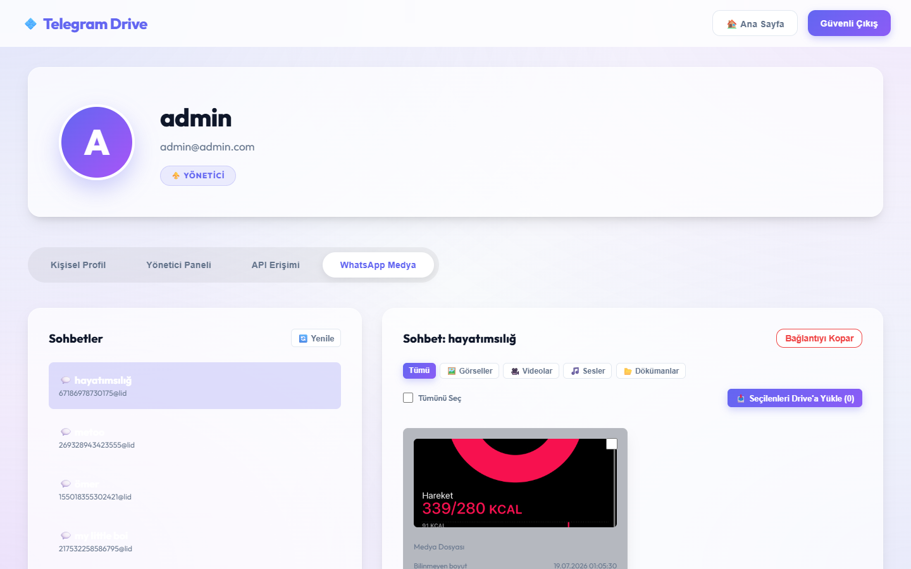

# Telegram Drive App

Telegram'i depolama katmani olarak kullanan bu repo, ayni urunun mobil, PHP web/API ve deneysel Python varyantlarini tek yerde toplar. Ana aktif akis `php_version` ve `native/project` uzerinden ilerler.

## Neler Var

- React Native mobil istemci
- Slim 4 tabanli PHP backend ve web arayuzu
- Telegram bot tabanli upload, download ve stream akisi
- Klasorleme, favori, cop kutusu ve paylasim ozellikleri
- Tekli ve coklu dosya paylasim sayfalari
- Coklu secim ve ZIP indirme akisi
- Buyuk dosyalar icin parcali upload ve yeniden birlestirme

## Dizinler

### `native/project`

Expo Router tabanli mobil istemci.

Baslica alanlar:

- `app/(app)/dashboard.tsx`: istatistikler, hizli erisim, son aktiviteler
- `app/(app)/files.tsx`: dosya gezgini, klasor akisi, favori, cop kutusu, paylasim
- `app/(app)/upload.tsx`: yukleme kaynagi, kuyruk ve multipart akisi
- `app/(app)/profile.tsx`: profil, plan ve ayarlar
- `services/uploadFormData.ts`: mobilde ortak multipart/form-data yardimcisi

Kullanimdaki teknolojiler:

- Expo SDK 54
- React Native 0.81
- Expo Router
- Axios
- Expo Video
- Expo Document Picker / Image Picker

### `php_version`

Uretimde esas backend ve tarayici tabanli dosya merkezi burada yer alir.

Baslica alanlar:

- `public/index.php`: tum API route'lari, stream, preview, paylasim, ZIP bundle, auth
- `templates/index.html`: web dashboard
- `templates/shares.html`: ayri paylasim merkezi
- `public/js/index.js`: dashboard etkileşimleri
- `src/Database.php`: tablo kurulum ve schema uyumlulugu

Desteklenen yetenekler:

- JWT tabanli auth
- klasor olusturma, renk ve ikon secimi
- favoriler, cop kutusu, geri yukleme ve kalici silme
- dosya yeniden adlandirma
- Telegram uzerinden guvenli indirme ve stream
- tekli paylasim linki
- coklu secim ile paylasim koleksiyonu olusturma
- secili dosyalari tek ZIP olarak indirme
- buyuk dosyalarda chunk metadata ile yeniden birlestirme
- **WhatsApp Medya Aktarımı ve Entegrasyonu** (OpenWA / whatsapp-web.js köprüsü ile):
  - QR kod okutarak kişisel sohbetleri ve grupları listeleme
  - Sohbet geçmişindeki son 100 medyayı anında tarama
  - PHP sunucu tarafında akıllı önbellek (`public/whatsapp_cache/`): İndirilen görseller bir kez önbelleğe alınır, sonraki yüklemeler ve Telegram transferleri milisaniyeler sürer
  - Hafıza dostu **lazy loading** önizleme sistemi: PHP memory_limit aşımını engeller, görselleri/videoları arayüzde asenkron ve canlı yükler
  - Medya filtreleme barı: Görseller, Videolar, Sesler ve Dökümanlar arasında anlık geçiş
  - Toplu Seçim ve Çoklu Seçim: Medyaları toplu olarak işaretleyip canlı SweetAlert ilerleme çubuğuyla sırayla Telegram Drive'a yükleme (başarılı yüklenenlerin seçimi otomatik kaldırılır)
  - **Arayüz Önizlemesi**:
    

### `python_version`

Alternatif / deneysel backend calismalari. Ana urun akisinin merkezinde degildir.

## Mimari Ozet

1. Mobil veya web istemci dosya ve klasor islemlerini API uzerinden baslatir.
2. PHP backend dosyayi Telegram'a yukler veya Telegram'dan stream eder.
3. Dosya metadata'si MySQL uzerinde tutulur.
4. Web ve mobil istemciler ayni API davranislarini kullanir.
5. Paylasim akislarinda Telegram dogrudan expose edilmez; indirme backend uzerinden proxy edilir.

## One Cikan Akislar

### Mobil

- dashboard ve hizli erisim
- ortak multipart upload yardimcisi
- favori, cop kutusu, geri yukleme
- paylasim linki ve onizleme
- buyuk dosya uyari ve preview kisitlari

### PHP Web

- modern dashboard arayuzu
- klasor kartlari ve hizli klasor ekleme
- dosya karti uzerinden secim, tasima ve toplu aksiyonlar
- ayri indirme alani
- ayri paylasim merkezi
- public coklu paylasim sayfasi

## Kurulum

### Mobil

```bash
cd native/project
npm install
npx expo start
```

Yardimci komutlar:

```bash
npm run android
npm run ios
npm run web
npm run lint
```

### PHP

```bash
cd php_version
composer install
php -S localhost:8000 -t public public/index.php
```

Gereksinimler:

- PHP 8.2+
- Composer
- MySQL veya MariaDB
- Telegram bot tokenlari

## Ortam Notlari

- `php_version` aktif veritabani akisinda MySQL kullanir.
- `Database::createTables()` eksik tablo ve kolonlari tamamlayarak calisir.
- Built-in PHP server ile gelistirme yaparken `public/index.php` router olarak kullanilmalidir.
- ZIP indirme akisi `ZipArchive` varsa onu kullanir; yoksa Windows ortaminda PowerShell fallback ile ZIP olusturur.

## Gelistirme Notlari

Son donemde eklenen veya guclendirilen alanlar:

- mobil ve PHP web tarafi arasinda ozellik esitligi
- ayri paylasim merkezi ve coklu paylasim koleksiyonlari
- secili dosyalari ZIP olarak tek indirme
- cop kutusundan Telegram dahil kalici silme
- buyuk dosyalar icin parcali upload ve indirme
- PHP dashboard icin yeni CSS/JS ayrimi
- **WhatsApp Medya Entegrasyonu**: OpenWA motoru ile tam entegrasyon, asenkron lazy-loading görsel/video önizleme arayüzü, sunucu taraflı disk önbelleklemesi (caching), filtreleme çubuğu, Tümünü Seç seçeneği ve SweetAlert destekli toplu Telegram Drive aktarım aracı.

## Lisans

Bu repo icin lisans dosyasi eklenmesi onerilir. Mevcut durumda dagitim yapilacaksa lisans ve ortam degiskeni dokumantasyonu netlestirilmelidir.
